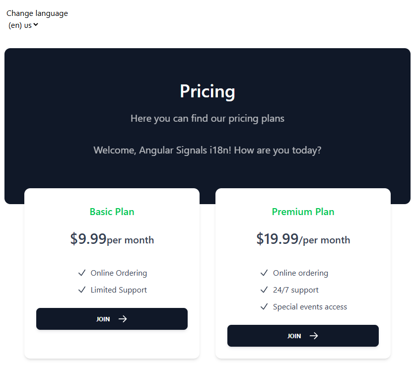
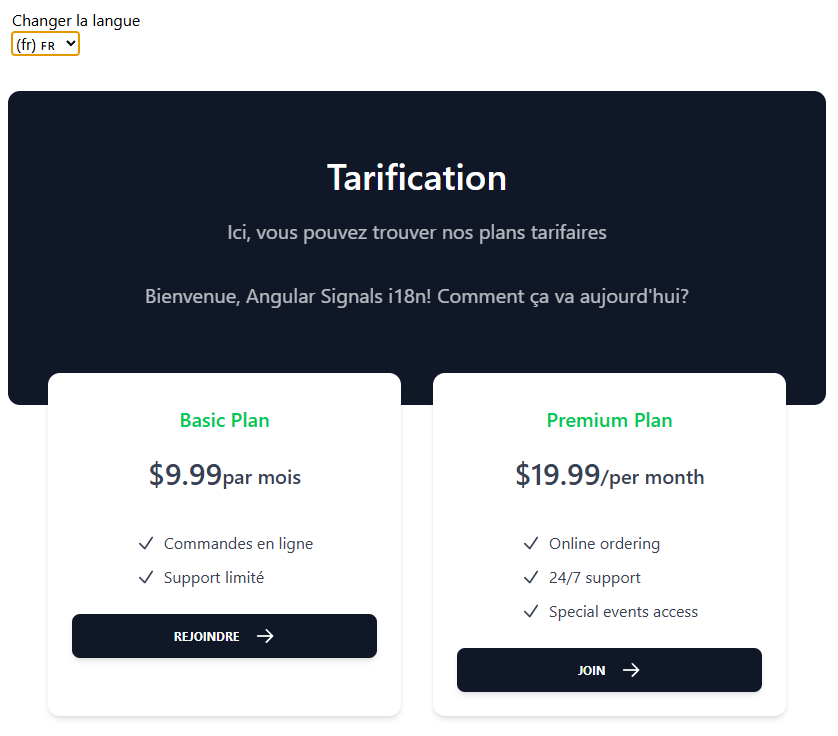

# Angular 2025 Project

This project is built using Angular version 19 and includes internationalization (i18n) support to cater to multiple languages.

## Table of Contents
- [Installation](#installation)
- [Usage](#usage)
- [Contributing](#contributing)
- [License](#license)
- [Screenshots](#screenshots)

## Installation

To install the project dependencies, run the following command:

```bash
npm install
```

## Usage

To start the development server, use the following command:

```bash
ng serve
```

## Contributing

We welcome contributions! Please fork the repository and submit a pull request.

## License

This project is licensed under the MIT License.

## Screenshots

Below are some screenshots showcasing the features and functionality of the application:





